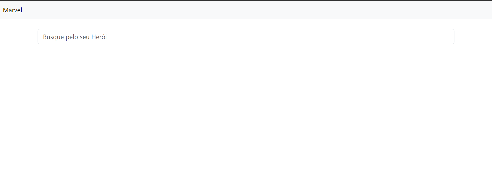
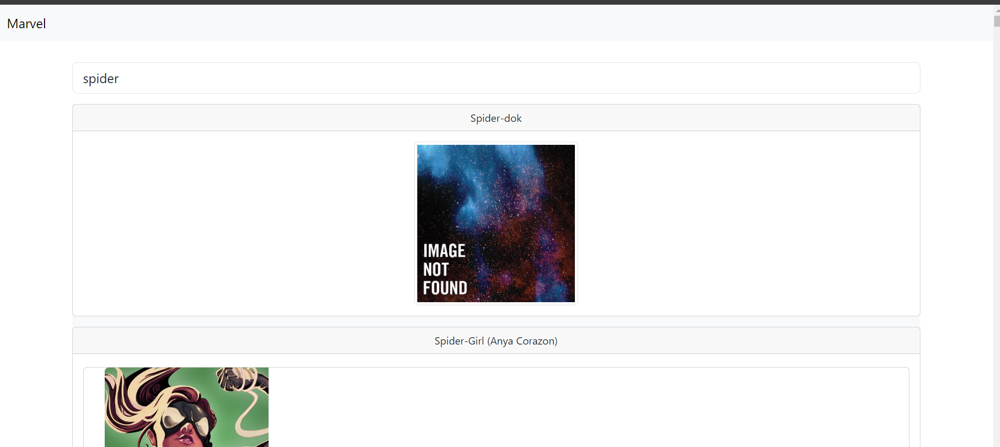

  

# MarvelAngular

  

[](https://github.com/joifogaca/marvel-angular#marvelangular)

  

This project was generated with [Angular CLI](https://github.com/angular/angular-cli) version 17.1.1.

  

## Deploy da aplicação (GitHubPages)

  

Aplicação rodando em produção:

https://joifogaca.github.io/marvel-angular/heroes

  
  

## O que foi desenvolvido

  

Uma aplicação Angular que realiza uma busca dinâmica pelos personagens da Marvel.

Ao encontrar o personagens que os nomes inicam com as letras digitadas, retorna para tela os seguintes dados do personagem:

  

- Nome

- Descrição

- Participação em quadrinhos

- Participação em histórias

  

De acordo com os dados consumidos pela API:

[Marvel Developer Portal - Interactive Documentation](https://developer.marvel.com/docs)

  

[](https://github.com/joifogaca/marvel-angular#o-que-foi-desenvolvido)

  
  

V.1.0

Tela de pesquisa

<p align="center">
  
</p>

Tela de retorno de pesquisa
<p align="center">
  
</p>


## Setup do projeto

  
  

```

gh repo clone joifogaca/marvel-angular

cd marvel-angular

npm install

```

  

### Como rodar o projeto

  

Rode`ng serve` para rodar em ambiente de desenvolvimento. Acesse a URL `http://localhost:4200/`.

  

### Gerando pacote e publicando no GitHub Pages com angular-cli-ghpages

  

ng build --base-href="https://joifogaca.github.io/marvel-angular/"

npx angular-cli-ghpages --dir=dist/marvel-angular/browser

  

## Dependências e Versões Necessárias

  

[angular-cli-ghpages](https://github.com/angular-schule/angular-cli-ghpages)

Utilizado para deploy e publicação no GitHub Pages

  

[uuid](https://github.com/uuidjs/uuid)

Para gerar identificadores únicos

  

[node-md5](https://github.com/pvorb/node-md5)

Para gerar hash md5

[Angular powered Bootstrap](https://ng-bootstrap.github.io/#/home)

Biblioteca de componentes Angular que utiliza como base de layout Bootstrap

  

## Próximos passos:

  

- [ ] Adicionar tratamento de erro nas requisições e avisar ao usuário em caso de falha

- [ ] Tratar casos em que a valores de string venham vazio **" "**

- [ ] Adicionar barra de carregamento na espera da lista de personagens

- [ ] Retornar para o usuário caso a API não retornar nenhum personagem

- [ ] Implementar um sistema de cache para retornar os personagens carregados anteriormente no sistema

- [ ] Adicionar teste unitário

- [ ] Limitar a busca a iniciar a com 3 caracteries

  

> Written with [StackEdit](https://stackedit.io/).
